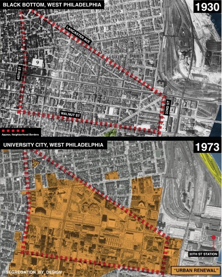

# Packages
```{r setup, include=FALSE}
knitr::opts_chunk$set(fig.height=4, fig.width=7, fig.align = 'center', warning = F)
if (!require("pacman")) install.packages("pacman")
pacman::p_load(sf, readxl, tidyverse, ggplot2, ggpmisc, ggpubr, censusxy,
               tigris, ndi, dplyr, mapview, tidycensus, RColorBrewer, leaps,
               skimr, GGaly, reshape2, glmnet, caret, Viridis) 
```

# Data 

# EDA 

## Introduce the Black Bottom

```{r out.width = "400px", echo = F, fig.cap="Logistic regression as 0-layer neural network", echo=FALSE}

```


[Insert description of the census tracts that we are looking at, talk about the non reseidential vs residential tracts]

```{r, warning=FALSE, message=FALSE, echo=FALSE}
# extract phila county geospatial data
pa.tracts <- get_acs(geography = "tract", 
              year = 2010,
              variables = c(tpopr = "B03002_001"), 
              state = "PA",
              county = "Philadelphia",
              output = "wide",
              survey = "acs5",
              geometry = TRUE,
              cb = FALSE)


na_tracts <-c("42101980400", "42101005000", "42101980200", "42101980100",
              "42101980900", "42101980700", "42101980600", "42101980800",
              "42101980500", "42101980000", "42101980300")

pa.tracts$res <- as.numeric(pa.tracts$GEOID %in% na_tracts,3:length(pa.tracts))

ggplot(pa.tracts,aes(fill = res)) + 
  geom_sf() +
  scale_fill_continuous(low="darkgrey", high="lightgrey") + 
  theme_void()+ 
  theme(legend.position = "none") +
  labs(title = "Philadelphia Census Tracts") 

```

## Gini income inequality 


[talk about how the gini inequality has changed over the time]

```{r, warning=FALSE, fig.width=25, fig.height=8, message=FALSE, echo=FALSE}
# extract gini coefficient for 2010 and generate a matrix
gini_2010 <- gini(geo = "tract", year = 2010, quiet = F, state = "PA", county = "Philadelphia")
philly_gini_all <- gini_2010$gini %>%
  dplyr::select(GEOID, gini) %>%
  dplyr::rename(!!as.character(2010) := gini)

# extract philly gini data for years 2010-2019
for (year in 2011:2019) {
  curData <- gini(geo = "tract", year = year, quiet = F, state = "PA", county = "Philadelphia")
  philly_gini_all <- curData$gini %>%
    dplyr::rename(!!as.character(year) := gini) %>%
    dplyr::select(GEOID, !!as.character(year)) %>%
    left_join(philly_gini_all, ., by ="GEOID")
}

philly_gini_all$mean_gini <- rowMeans(philly_gini_all[,2:length(philly_gini_all)])

# select top 5 and bottom 5 census tracts with the highest and lowest mean gini index, respectively
selected_tracts_high <- philly_gini_all[order(philly_gini_all$mean_gini, decreasing=T), ]$GEOID[1:10]
#print(selected_tracts_high)
selected_tracts_low <- philly_gini_all[order(philly_gini_all$mean_gini, decreasing=F), ]$GEOID[1:10]
#print(selected_tracts_low)

# flatten out df
philly_gini_melt <-philly_gini_all %>%
  dplyr::select(-mean_gini) %>%
  reshape2::melt()

# show change in gini index over time, highlighting census tracts with high gini
high_ineq_trend <- philly_gini_melt%>%
  ggplot(aes(x=variable, y=value, group =GEOID)) +
  geom_line(col = "grey", alpha = .5) + 
  geom_point(col = "grey", alpha = .5) +
  geom_line(data = subset(philly_gini_melt, GEOID %in% selected_tracts_high),
            aes(col = GEOID)) +
  geom_point(data = subset(philly_gini_melt, GEOID %in% selected_tracts_high),
            aes(col = GEOID)) +  
  scale_color_manual(values = viridis(10)) +
  theme_bw() +
  labs(y = "Gini Index", x = "Year") 


# plotting, subset census tracts with high gini to show where they are geographically
ineq_tracts <- pa.tracts %>%
  left_join(subset(philly_gini_all, GEOID %in% selected_tracts_high)) %>%
  mutate_if(is.numeric,coalesce,0)

# remove tracts that are always na (park and river area) and non residential
na_tracts <-c("42101980400", "42101005000", "42101980200", "42101980100",
              "42101980900", "42101980700", "42101980600", "42101980800",
              "42101980500", "42101980000", "42101980300")

ineq_tracts[ineq_tracts$GEOID %in% na_tracts,3:length(ineq_tracts)] <- NA

# plot showing areas in west, center city east, and north philly experience the highest income inequality
high_ineq_geo <- ggplot(data = ineq_tracts, aes(fill = mean_gini)) + 
  geom_sf() +
  scale_fill_continuous(low="grey", high="mediumpurple", 
                       guide="colorbar",na.value="white") + 
  theme_void()

plot1 <- ggarrange(high_ineq_trend, high_ineq_geo, ncol = 2, nrow = 1, common.legend = TRUE,legend="bottom")

high_plot <- annotate_figure(plot1, top = text_grob("Census tracts with highest Income inequality", face = "bold", size = 14))

# same analysis as above but with the lowest income inequality

low_ineq_trend <- philly_gini_melt%>%
  ggplot(aes(x=variable, y=value, group =GEOID)) +
  geom_line(col = "grey", alpha = .5) + 
  geom_point(col = "grey", alpha = .5) +
  geom_line(data = subset(philly_gini_melt, GEOID %in% selected_tracts_low),
            aes(col = GEOID)) +
  geom_point(data = subset(philly_gini_melt, GEOID %in% selected_tracts_low),
            aes(col = GEOID)) +  
  scale_color_manual(values = viridis(10)) +
  theme_bw() +
  labs(y = "Gini Index", x = "Year") 

ineq_tracts <- pa.tracts %>%
  left_join(subset(philly_gini_all, GEOID %in% selected_tracts_low)) %>%
  mutate_if(is.numeric,coalesce,0)

na_tracts <-c("42101980400", "42101005000", "42101980200", "42101980100",
              "42101980900", "42101980700", "42101980600", "42101980800",
              "42101980500", "42101980000", "42101980300")

ineq_tracts[ineq_tracts$GEOID %in% na_tracts,3:length(ineq_tracts)] <- NA


low_ineq_geo <- ggplot(data = ineq_tracts, aes(fill = mean_gini)) + 
  geom_sf() +
  scale_fill_continuous(low="grey", high="mediumpurple", 
                       guide="colorbar",na.value="white") + 
  theme_void()


plot2 <- ggarrange(low_ineq_trend, low_ineq_geo, ncol = 2, nrow = 1, common.legend = TRUE,legend="bottom")

low_plot <- annotate_figure(plot2, top = text_grob("Census tracts with lowest Income inequality", face = "bold", size = 14))


ggarrange(high_plot, low_plot, ncol = 2, nrow = 1)

```


## looking specifically at 2010

[introduce why we're specifically looking at 2010 (that's when most of our other data sets are from)]

```{r, message=FALSE, echo=FALSE}
census_disp = read.csv("data/census_healthdisp_cleaned.csv")

census_disp %<>%
  mutate(TractFIPS = as.character(TractFIPS), 
         YEAR = as.factor(YEAR)) %>%
  rename(heat_health_impacts = N_VERYHIGH) %>%
  mutate(heat_health_impacts = as.factor(heat_health_impacts)) %>%
  dplyr::select(-X)

gini2010philly = gini(geo = "tract", state = "PA", county = "Philadelphia", year = 2010)


tracts2010philly = tigris::tracts(state = "PA", county = "Philadelphia", year = 2010, cb = TRUE) %>%
  mutate(GEO_ID = gsub("1400000US","", GEO_ID)) %>%
  dplyr::rename(GEOID = GEO_ID)


tracts2010philly_gini = dplyr::left_join(tracts2010philly, gini2010philly$gini, by = "GEOID")


tracts2010philly2 = tracts2010philly %>%
  rename(TractFIPS = GEOID)
census_disp_geo = left_join(tracts2010philly2, census_disp, by = "TractFIPS")
```


```{r}
tracts2010philly_gini %>%
  ggplot() +
  geom_sf(data = tracts2010philly_gini,
          aes(fill = gini),
          color = "white") +
  ggplot2::scale_fill_viridis_c() +
  theme_void()


```


## test visualiazations after data cleaning 

```{r}
merge3 %>%
  ggplot(aes(x = HVI_SCORE, y = COPD_CrudePrev)) + 
  geom_point() +
  geom_smooth(method = "lm") + 
  stat_poly_eq(use_label(c("eq", "R2"))) + 
  theme_bw()

merge3 %>%
  ggplot(aes(x = avgPCT_HPSS, y = BPHIGH_CrudePrev)) + 
  geom_point() +
  geom_smooth(method = "lm") + 
  # stat_poly_eq(use_label(c("eq", "R2"))) + 
  stat_regline_equation(label.y = 60, aes(label = ..eq.label..)) +
  stat_regline_equation(label.y = 55, aes(label = ..rr.label..)) +
  theme_bw()
```


```{r}
merge3.1 %>%
  ggplot(aes(x = sumTOTAL_UNITS, y = BPHIGH_CrudePrev, size = avgPCT_POVERTY, color = N_VERYHIGH)) + 
  geom_point(alpha = 0.5) +
  # geom_smooth(method = "lm", se = F) + 
  # stat_poly_eq(use_label(c("eq", "R2"))) + 
  # stat_regline_equation(label.y = 60, aes(label = ..eq.label..), show.legend = F) +
  # stat_regline_equation(label.y = 55, aes(label = ..rr.label..), show.legend = F) +
  scale_color_discrete(labels=c('No', 'Yes')) +
  labs(x = "Total Affordable Housing Units", y = "Prevalenace of High Blood Pressure", title = "Integrated view of health disparities, poverty, and environmental factors" ) +
  guides(size=guide_legend(title="Average % Poverty"), 
         color=guide_legend(title="High Heat-Related Illness")) +
  theme_bw() + 
  theme(legend.position = "left")
```


```{r}
merge3.2 %>%
  ggplot(aes(x = sumTOTAL_UNITS, 
             y = transit_score, 
             color = CANCER_CrudePrev, 
             shape = N_VERYHIGH)) + 
  geom_point(alpha = 0.7,
             size = 3,
             stroke = 1) +
  # geom_smooth(method = "lm", se = F, show.legend = F) +
  # stat_poly_eq(use_label(c("eq", "R2"))) + 
  # stat_regline_equation(label.y = 60, aes(label = ..eq.label..), show.legend = F) +
  # stat_regline_equation(label.y = 55, aes(label = ..rr.label..), show.legend = F) +
  labs(x = "Total Affordable Housing Units", y = "Transit Score", title = "EDA" ) +
  scale_shape_discrete(labels=c('No', 'Yes')) +
  scale_color_gradient(low = "lightblue", high = "orange", na.value = NA) +
  guides(color=guide_legend(title="Cancer Prevalence"), 
         shape=guide_legend(title="High Heat-Related Illness")) +
  theme_bw() + 
  theme(legend.position = "right")
```


## eda looking at relationship of our variables
```{r}
census_disp = read.csv("data/census_healthdisp_cleaned.csv")
```

[distributions of hospitals]
```{r, message=FALSE}
hospitals <- readRDS("data/hospitals_cleaned.RDS") %>%
  dplyr::rename(street = STREET_ADDRESS, 
         city = CITY, 
         state = STATE)
  
hospitals_sf <- cxy_geocode(hospitals,
                            street = "street", 
                            city = "city", 
                            state = "state", 
                            class = "sf")
```

```{r}
mapview::mapview(hospitals)
```

[istribution of affordable housing]

```{r}
affordable_housing <- readRDS("data/affordable_housing_geoid.rds") 
  
affordable_housing_sf <- cxy_geocode(affordable_housing,
                            street = "street", 
                            city = "city", 
                            state = "state", 
                            class = "sf")
```

```{r}
mapview::mapview(affordable_housing_sf)
```


[talk about how transit and walk score is a little lower in our tracts with high inequality]

```{r}
transit_score_plot <- census_disp_geo %>%
  ggplot() +
  geom_sf(data = census_disp_geo, aes(fill = transit_score),
          color = "white") +
  ggplot2::scale_fill_viridis_c() +
  theme_void()

walk_score_plot <- census_disp_geo %>%
  ggplot() +
  geom_sf(data = census_disp_geo, aes(fill = walk_score),
          color = "white") +
  ggplot2::scale_fill_viridis_c() +
  theme_void()

bike_score_plot <- census_disp_geo %>%
  ggplot() +
  geom_sf(data = census_disp_geo, aes(fill = bike_score),
          color = "white") +
  ggplot2::scale_fill_viridis_c() +
  theme_void()

car_availability_plot <- census_disp_geo %>%
  ggplot() +
  geom_sf(data = census_disp_geo, aes(fill = avgPCT_VEHICLE_AVAIL),
          color = "white") +
  ggplot2::scale_fill_viridis_c() +
  theme_void()

plot_transport <- ggarrange(transit_score_plot, walk_score_plot, bike_score_plot, car_availability_plot, ncol = 2, nrow = 2)

annotate_figure(plot_transport, top = text_grob("Utility of Public Transport, Walkability, Bikebility, and Car availability by Census Tracts", face = "bold", size = 10))

```


[Talk about we see both high and low produce supermarkets and stores in our tracts with high inequality]

we also have number of restaurants but don't include the anlysis here for brevity

```{r}
hpss_plot <- census_disp_geo %>%
  ggplot() +
  geom_sf(aes(fill = avgHPSS_PER1000),
          color = "white") +
  ggplot2::scale_fill_viridis_c() +
  theme_void()

lpss_plot <- census_disp_geo %>%
  ggplot() +
  geom_sf(aes(fill = avgLPSS_PER1000),
          color = "white") +
  ggplot2::scale_fill_viridis_c() +
  theme_void()


plot_food_access <- ggarrange(hpss_plot, lpss_plot, ncol = 2, nrow = 1)

annotate_figure(plot_food_access, top = text_grob("High vs. Low Produce Supemarkets and Stores by Census Tracts", face = "bold", size = 14))
```

# Analysis 

## Linear Model 

model data prep 

```{r}
final_data = readRDS("data/final_data.RDS") %>%
  as.data.frame() %>%
  # select(-COUNT_ALL_RACES_ETHNICITIES) %>%
  mutate(heat_health_effects = as.factor(N_VERYHIGH)) %>%
  dplyr::select(-N_VERYHIGH)
```


```{r}
# final dat
set.seed(2)
index <- sample(nrow(final_data), round(nrow(final_data)*.70), replace = F)
final_data_train <- final_data[index,]
dim(final_data_train)
final_data_test <- final_data[-index, ]
dim(final_data_test)
```

```{r}
health_columns <- c(1, grep("[A-Z]*_CrudePrev",colnames(final_data)))
demog_columns <- colnames(final_data)[grep("COUNT_.*|PERCENT_.*",colnames(final_data))]
Ys <- colnames(final_data)[health_columns]
features <- colnames(final_data)[!(colnames(final_data) %in% Ys) &
                                        !(colnames(final_data) %in% demog_columns)]

Ys #health stuff
features
```


```{r}

# models = matrix(nrow = length(Ys[-1]), ncol = length(features))

models = list()
all_ps = list()
betas = list()
  
for(i in 1:length(Ys[-1])){
  f = as.formula(
  paste(Ys[i], 
        paste(features, collapse = " + "), 
        sep = " ~ "))
  
  #get model and add to list 
  model = lm(f, final_data)
  models[[Ys[-1][i]]] = model
  
  #get significant ps
  p = coef(summary(model))[,4]
  all_ps[[Ys[-1][i]]] = p 
  
  #get betas
  beta = coef(summary(model))[,1]
  betas[[Ys[-1][i]]] = beta
  
  
}

# print(f)
ps.df<- as.tibble(all_ps)
betas.df<- as.tibble(betas)

betas.df$variables <- names(betas[[1]])

betas.df


```

```{r, fig.width=12, fig.height=10}

change_matrix <- function(p_mat, beta_mat) {
    new_mat <- matrix(nrow = nrow(p_mat), ncol = ncol(p_mat)-1)
    
    # iterate through and find values that are not significant
    for(i in 1:nrow(new_mat)) {
        for(j in 1:ncol(new_mat)) {
            
            if(p_mat[i,j] < .05) {
                new_mat[i,j] <- beta_mat[i,j]
                if(beta_mat[i,j] == "Inf") { 
                    new_mat[i,j] <- NA
                }
                
            }else {
                new_mat[i,j] <- NA
            }
        }
    }
    
    #print(new_mat)

    
    rownames(new_mat) <- beta_mat$variables
    colnames(new_mat) <- colnames(p_mat)[1:(length(p_mat)-1)]
    
    
    return(data.frame(new_mat))                                      

}

significant_df <- change_matrix(ps.df, as.data.frame(betas.df))
scaled_significant_df <- scale(t(significant_df[-1,]), scale = TRUE) %>% as.data.frame()

pheatmap(scaled_significant_df, na_col = "#FFFFFFFF",
         cluster_cols = F, cluster_rows = F,
         color = inferno(100))

#rownames(scaled_significant_df)[scaled_significant_df$gini>0 & !is.na(scaled_significant_df$gini)]
#rownames(scaled_significant_df)[scaled_significant_df$gini<0 & !is.na(scaled_significant_df$gini)]

#scaled_significant_df$avgPCT_POVERTY

```

pos gini beta: "COPD_CrudePrev", "COREM_CrudePrev", "DIABETES_CrudePrev"
negative gini beta: "ARTHRITIS_CrudePrev", "BPMED_CrudePrev", "COLON_SCREEN_CrudePrev", "DENTAL_CrudePrev", "HIGHCHOL_CrudePrev", "MAMMOUSE_CrudePrev", "PAPTEST_CrudePrev","SLEEP_CrudePrev", "STROKE_CrudePrev" 

## Model Selection 

### Forward Selection 

### Backward Selection 

### LASSO 

# LASSO - predicting diseases 

LASSO loop
```{r}
# 
# models = list()
# all_ps = list()
# betas = list()

lasso_models = list()
plots_lasso = list()
lasso_coefs = list()

models_min = list()
all_ps_min = list()
betas_min = list()

for(i in 1:length(Ys[-1])){
  
  f = as.formula(
  paste(Ys[-1][i], 
        paste(features, collapse = " + "), 
        sep = " ~ "))
  
  cur_feature <- Ys[-1][i]
  y <- final_data %>% dplyr::select(!!cur_feature)
  X1 <- model.matrix(f, final_data)[, -1]
  fit.lasso <- cv.glmnet(X1, y[[1]], alpha=1)
  
  lasso_models[[Ys[-1][i]]] = fit.lasso #save model 
  plots_lasso[[Ys[-1][i]]] = plot(fit.lasso, main = Ys[-1][i]) # save plot 
  
  #get coefs
  coef.min = coef(fit.lasso, s = "lambda.1se")
  coef.min = coef.min[which(coef.min !=0),]
  lasso_coefs[[Ys[-1][i]]] = coef.min
  
  
  features_sub <- rownames(as.matrix(coef.min))[-1]
  
  if (sum(grepl("heat_health.*", features_sub)) > 0) {
    index = grep("heat_health.*", features_sub)
    features_sub[index] = substr(features_sub[index], 1, nchar(features_sub[index])-1)
  }
  
  final_data_sub <- final_data %>% dplyr::select(all_of(c(Ys[-1][i], features_sub)))
  
  f_new <- as.formula(
  paste(Ys[-1][i], 
        paste(features_sub, collapse = " + "), 
        sep = " ~ "))
  model_min = lm(f_new, final_data_sub)
  
  #get model and add to list 
  models_min[[Ys[-1][i]]] = model_min
  
  #get significant ps
  p = coef(summary(model_min))[,4]
  all_ps_min[[Ys[-1][i]]] = p 
  
  #get betas
  beta = coef(summary(model_min))[,1]
  betas_min[[Ys[-1][i]]] = beta
  
}


# summary(models_min$ACCESS2_CrudePrev)
# 
# summary(models_min$CANCER_CrudePrev)
# 
# summary(models_min$CASTHMA_CrudePrev)
# 
# summary(models_min$STROKE_CrudePrev)
# 
# summary(models_min$DIABETES_CrudePrev)

lasso_models

```

## Reduced Linear Model

# Appendix I: Data Cleaning 

Data landing and inspection 

```{r}
affordable_housing = read.csv("data/Affordable_Housing.csv", header = T)
heat_vuln = read.csv("data/HEAT_EXPOSURE_CENSUS_TRACT.csv", header = T)
food_access = read.csv("data/NeighborhoodFoodRetail.csv", header = T)
hospitals = read.csv("data/Hospitals.csv", header = T)
population_philly = read.csv("data/Vital_Population_CT.csv", header = T)
cities_census_health_full = read.csv("data/500_Cities__Census_Tract-level_Data__GIS_Friendly_Format___2019_release.csv",header = T)
census_block_groups10 = read.csv("data/Census_Block_Groups_2010.csv")
census_blocks10 = read.csv("data/Census_Blocks_2010.csv")
```

In order to directly download data from the Census API, you need a [key](http://api.census.gov/data/key_signup.html). You can sign up for a free key here. Type your key in quotes using the census_api_key() command.

```{r}
# get accesss to the census api
# census_api_key("f4a30edf07058b5e59f5bbfe6c2cc2cc7bbb8029", install = TRUE)
```

```{r}
census_blocks10$GEOID10 = as.factor(census_blocks10$GEOID10)
```


376 tracts here
```{r}
head(cities_census_health_full)

philly_census_health = cities_census_health_full %>%
  filter(PlaceName == "Philadelphia")
```


384 census tracts here (2010 data)
```{r}
head(population_philly)

population_philly = population_philly %>%
  dplyr::rename(TractFIPS = GEOGRAPHY_NAME) 
```


384 census tracts here (2010 data)
```{r}
head(heat_vuln)

heat_vuln = heat_vuln %>%
  dplyr::rename(TractFIPS = GEOID10)

heat_vuln %>% #sanity check 
  filter(TractFIPS ==42101000100)
```


philly_census_health x population_philly (by race) 
```{r}
merge1 = merge(philly_census_health, population_philly, by = "TractFIPS")
head(merge1)
dim(merge1) #376 tracts and 77 columns, some which may not be used 

# merge1 + heat vulnerability = philly census health, population by race, and heat vulnerability
merge2 = merge(merge1, heat_vuln, by = "TractFIPS" )
head(merge2)
dim(merge2) #376 census tracts and 88 variables 
```


Next we just need to separate out the last digit in the food_access GEOID10 to transform the census block group number into a census tract number (https://www.census.gov/programs-surveys/geography/guidance/geo-identifiers.html#:~:text=Census%20Tract,482012231001)
```{r}
food_access = food_access %>%
  mutate(new_tracts = substr(GEOID10,1,nchar(GEOID10)-1)) %>%
  dplyr::rename(TractFIPS = new_tracts)
```

The new census tract column is now ``TractFIPS`` like the other datasets. 

Then we can average the estimates for each census tract to get one row of data for each census tract. 

```{r}
food_access_agg = food_access %>%
  arrange(TractFIPS) %>%
  group_by(TractFIPS) %>%
  summarise(sumTOTAL_LPSS = sum(TOTAL_LPSS),
            avgLPSS_PER1000 = mean(LPSS_PER1000),
            sumTOTAL_HPSS = sum(TOTAL_HPSS),
            avgHPSS_PER1000 = mean(HPSS_PER1000),
            avgPCT_HPSS = mean(PCT_HPSS),
            avgPCT_VEHICLE_AVAIL = mean(PCT_VEHICLE_AVAILABILITY),
            sumTOTAL_RESTAURANTS = sum(TOTAL_RESTAURANTS),
            avgPCT_POVERTY = mean(PCT_POVERTY))

head(food_access_agg)
```

So now that we are down to about 380 census tracts, we can merge with the other data for ``merege3`` 

```{r}
# merge2 + food_access_ag = philly census health, population by race, heat vulnerability, and food access
merge3 = merge(merge2, food_access_agg, by = "TractFIPS" )
head(merge3)
dim(merge3) #376 census tracts and 94 variables 

merge3$TractFIPS = as.character(merge3$TractFIPS) #tidying up 
```


Geolocating addresses (for the housing and hospital data) to census tracts
```{r}
affordable_housing2 = affordable_housing %>%
  dplyr::rename(street = ADDRESS) %>%
  mutate(city = "Philadelphia", 
         state = "PA")

# Generate geoids for the address list
# affordable_housing2_geoid = append_geoid(affordable_housing2, 'tract')

#since this takes a minute, I'll save it as an RDS file 
# saveRDS(affordable_housing2_geoid, file = "data/affordable_housing_geoid.rds")

affordable_housing2_geoid = readRDS("data/affordable_housing_geoid.rds")


# affordable_housing2_geoid = affordable_housing2_geoid %>%
#   rename(TractFIPS = geoid )
```


```{r}
# Get the total number of affordable housing units by census tract

affordable_housing2_geoid = affordable_housing2_geoid %>%
  group_by(TractFIPS) %>%
  summarise(sumTOTAL_UNITS = sum(TOTAL_UNITS)) %>%
  drop_na() #leaves 144 census tracts with known addresses and affordable housing units

# merge3.1 = affordable_housing_geoid, food_access_agg, philly census health, population by race, heat vulnerability

merge3.1 = left_join(merge3, affordable_housing2_geoid, by = "TractFIPS")

# merge3.2 = walk score, affordable_housing_geoid, food_access_agg, philly census health, population by race, heat vulnerability 

merge3.2 = merge(merge3.1, walk, by = "TractFIPS")
```


Getting census tract-level gini indices 
```{r}

philly_tract_gini = gini(geo = "tract", year = 2010, quiet = F, state = "PA", county = "Philadelphia")

saveRDS(philly_tract_gini, "data/philly_census_tract_gini.rds")

colnames(philly_tract_gini[[1]])

philly_tract_gini_df = philly_tract_gini[[1]] %>%
  dplyr::rename(TractFIPS = GEOID)
```

Merge these with the rest of the data matrix 
```{r}
# merge4 = gini, walk score, affordable_housing_geoid, food_access_agg, philly census health, population by race, heat vulnerability

merge4 = merge(merge3.2, philly_tract_gini_df, by = "TractFIPS")
```

Preparing hospital data 
```{r}
new_hosp = readRDS("data/hospitals_cleaned.RDS")
head(new_hosp)

new_hosp = new_hosp %>%
  dplyr::rename(street = STREET_ADDRESS, 
         city = CITY, 
         state = STATE)

new_hosp_geoid = append_geoid(new_hosp, 'tract')

new_hosp_geoid = new_hosp_geoid %>%
  dplyr::rename(TractFIPS = geoid)

new_hosp_geoid_pct = new_hosp_geoid %>%
  group_by(TractFIPS) %>%
  summarise(n = n()) %>%
  ungroup() %>%
  mutate(pct_hosp = n/sum(n))

```


Final merge 
```{r}
merge5 = left_join(merge4, new_hosp_geoid_pct, by = "TractFIPS")

#take out shapes and add them as a variable 

merge5_new = merge5 %>%
  select(-PlaceName, -PlaceFIPS, -Place_TractID, -StateAbbr, -Geolocation.x, -Geolocation.y, -OBJECTID.x, -OBJECTID.y, -GEOGRAPHY, -colnames(merge5)[grep(".*_Crude95CI", colnames(merge5))], -OBJECTID_1, -Shape__Area.x, -Shape__Length.x, -Shape__Area.y, -Shape__Length.y, -tract, -county, -state, -NAME10) %>%
  dplyr::rename(n_hospitals = n)

dim(merge5_new)

# write.csv(merge5_new, "data/census_healthdisp_cleaned.csv")
```


